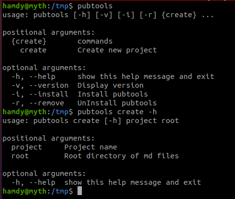
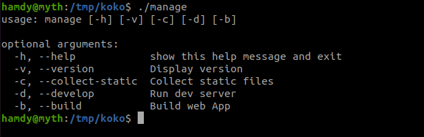

## Installation

### Install pubtools

- Install (needs sudo permissions)
  ```
  curl -sL https://raw.githubusercontent.com/threefoldfoundation/gridsome-docc/master/bin/pubtools -o /tmp/pubtools && chmod u+x /tmp/pubtools && /tmp/pubtools -i
  ```

- Run `pubtools`

  

### create a new project

- Create using `pubtools create {project_name} {root}` i.e `pubtools create my-proj ~/wikis`
- Newly created projects will have the example under `examples` dir copied to root i,e `~/wikis` and working

### Manage projects
- Inside each project there's a manager file `./manage` 

   

- commands
  - `./manage -d` development server
  - `./manage -b` build project
  - `./manage -c` Collect static files from `{root}` i.e ~/wikis to local `static` directory inside the project so it can be resolved correctly

### Support for markdown inclusions

use  `!!!include:$orgname:$reponame:$docname` i.e `!!!include:$github:$wikis2:$settings`  in your marddown page to include another page

### Notes
- for each repo in `{root}` i.e `~/wikis/github` there should be a `static` directory which holds all static files for that repo and you should reference images using `` i.e  for a page in `wiki2` repo to reference static file in `wikis2/static` we do something like ``

### Example (Ruuning wiki2020)
- Create a new project `pubtools create mywikis ~/wikis`
- Make sure scaffold example is running `cd mywikis && ./manage -d`
- Clone wikis2020 
  - `cd ~/wikis/github && git@github.com:threefoldfoundation/wiki_2020.git`
  - `cd wiki_2020`
  - `git checkout pubtools`
  - Add a new sidebar for the `wiki2020`
    - Open `wiki2020/gridsome.config.js`
    - copy `sidebar`, and nav parts into your newly project config file `mywikis/gridsome.config.js`
  - Run 
    - Got to your project `cd mywikis`
    - Collect static files `./manage -c`
    - Run `./manage -d`

### Docs
- [Gridsome](https://gridsome.org/)
- [Gridsome-docc](https://docc-theme.netlify.app/)


